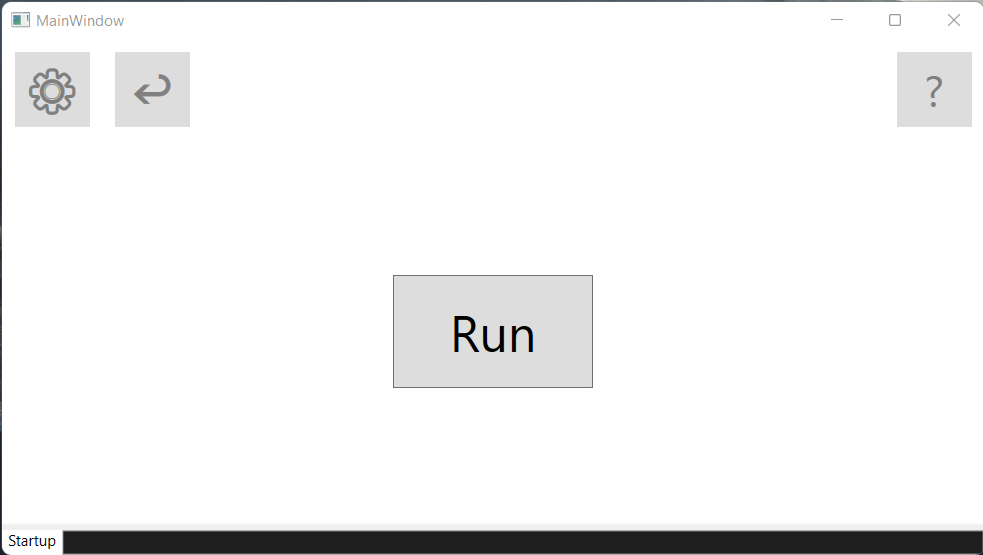
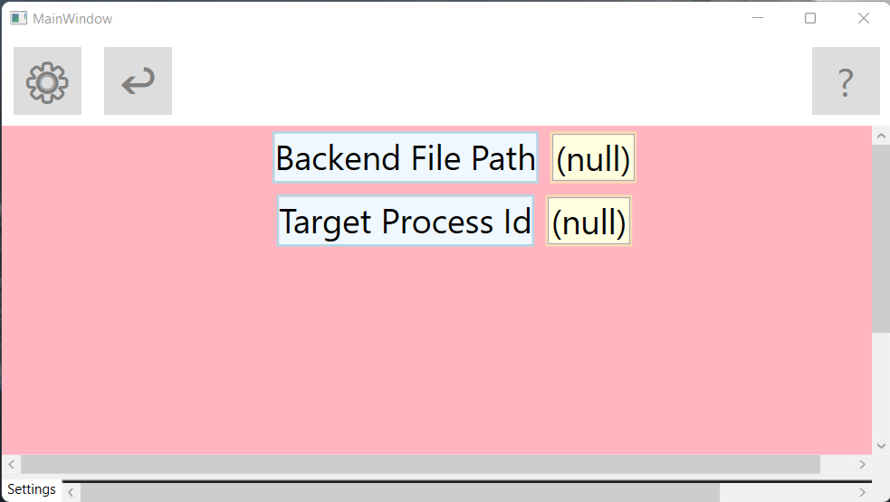
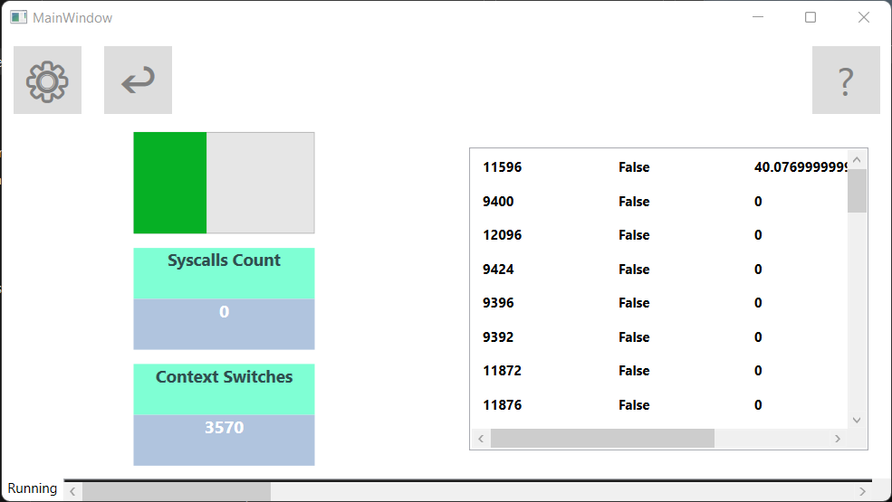
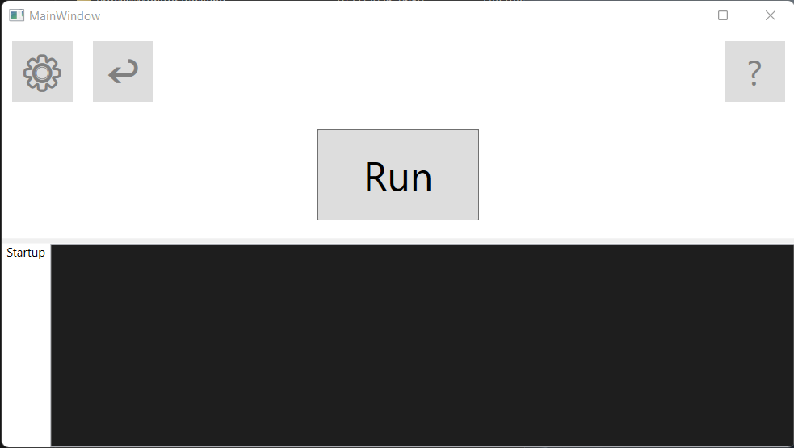

<div align="center">
   <a href="https://github.com/serdekh/process-monitor/releases">
      
   </a>

   # ProcessMonitor

   ## Client-server based desktop application for process diagnosis 

   
   
   

     
</div>

## Description

A desktop application which allows you gather metrics related to a given [process](https://en.wikipedia.org/wiki/Process_(computing)).

The metrics include: [context switches](https://en.wikipedia.org/wiki/Context_switch), [cpu usage](https://en.wikipedia.org/wiki/CPU_time) for processes and therads, [syscall invocations](https://en.wikipedia.org/wiki/System_call), etc.

The architecture is [client-server](https://en.wikipedia.org/wiki/Client%E2%80%93server_model) based. The server is dynamically invoked when metrics collection is requested.
The underlying behaviour is achieved through the [event tracing system](https://learn.microsoft.com/en-us/windows/win32/etw/event-tracing-portal) of Windows and the [named pipes](https://learn.microsoft.com/en-us/windows/win32/ipc/named-pipes) based [IPC](https://en.wikipedia.org/wiki/Inter-process_communication).

## Installation

To install the pre-built application bundle, check the [releases](https://github.com/serdekh/process-monitor/releases) page.

Alternatively, you can clone the repo and build the project using the following command:

```powershell
cd .\Source; .\build.ps1 -Target desktop -Run
```

# Usage

At the current project state, the final bundle contains two project folders: `ProcessMonitor.Backend` and `ProcessMonitor.WPF` plus the `ProcessMonitor` shortcut to the executable file.

Click on the shortcut to run the application.

> Note: In order to startup the event tracing services, the application has to run in the administrator mode. Otherwise the server process would not be able to start.

You will be greeted with the following window: 

<div align="center">
   
</div>
<br/>

Before clicking on the **Run** button, the client has to configure two things: **the path to the backend executable** and **the process id**.

Click on the **Settings** button (_with the gear icon_) to switch to the **Settings mode**.

After that, you will see this window:

<div align="center">
   
</div>
<br/>

Copy the path to your **ProcessMonitor.Backend.exe** file (_located in the bundle file with the following relative path: "Release\ProcessMonitor.Backend\ProcessMonitor.Backend.exe"_)

> Note: The current pre-release state does not have a built-in automated configuration system forcing the manual copy of the server application path. It will be fixed in the following releases.

Then insert the **id** of a **process** that you want to get the metrics from.

> Note: Similarly, no pop-up window for picking an id from the UI exists. This is a subject to change.

Once everyting is setup, click on the **GoBack** button (_marked with the ↩ emoji_). You will get back to the **Startup mode**.

Then click on the **Run** button and enjoy the collected process metrics window of the **Running mode**:

<div align="center">
   
</div>
<br/>

> Note: The green bar represents the cpu usage. In this case the process was downloading a big file.

> Note: The main issue with the metrics engine is visible here: no syscalls count are displayed. This is the main reason why the project is currently at the pre-release stage. This is a subject to change.

> Note: In this example most of the threads have zero cpu usage since they were freed.

You can then use the **Go back** button again to go the **Startup mode** or you click on the gear button and go directly to the **Settings mode** to examine another process.

This is whole essence of the application.

Additionally, you will find this logging window:

<div align="center">
   
</div>
<br/>

It logs any errors and warnings which might occur during the execution such as data errors:

- Incorrect backend file path
- Process with such ID does not exist 
- Could not instantiate a server process
- etc.

(_the logging window is a part of the core layout and is included for every mode the application is currently in. To extend it, use the grid splitter between the logging and the main windows._)

There is also the **?** button on the right corner which pops up a window for displaying informational messages. However it's not yet implemented and does not show anything for now. This is also a subject to change before publishing the next release.

# Architecture

The project is built on top of the **Client-Server model**. The UI and the metrics evaluation are split into two distinct applications. The UI project acts as a master and the server acts as its slave. When a user requests a new metric, the client side instantiates a server process. When the user stops the client application, the server process gets killed automatically.

To facilitate communication between the processes, the **named pipes** are used. From the OS perspective, named pipes are a _file system_ and they implement the inter-process communication mechanism. They exist independently from the normal file systems like _exFAT32_ or _NTFS_ and this system in its core works parallel to the **socket** api found on most **UNIX** systems.

In the closer look, both applications are composed of multiple layers with each layer having a dedicated purpose:

The server application:
- Events accumulation
- Commands processing
- Hosting management
- Internal modeling
- Metrics evaluation
- Runtime state management
- **IPC transporation (duplex)**

The client application:
- Hosting management
- UI 
- **IPC transporation (one-way)**

Note that both of these projects share the same layer dedicated for communication. 

Both the server and the client define two pipes: first - for request/response pipeline, second - for telemetry. 

The server creates a duplex pipe for the request/response pipeline and a one-way pipe for the telemetry since it only needs to send the metrics and not receive them.

The client creates a one-way pipe for the request/response pipeline because it only sends the requests and does not handle server responses. This might be changed once the client becomes more robust to properly handle the server responses.

Both applications utilize the **IHost** interface to create a runtime execution environment where each service is controled and managed by a single host object. 

Thus, architecturewise, the whole application acts like an (ASP.NET Core Minimal API)[https://learn.microsoft.com/en-us/aspnet/core/tutorials/min-web-api?view=aspnetcore-10.0&tabs=visual-studio] one with the only difference being on where the data traffic is travelling in (in case of this project, instead of moving through the web and the kestrel server, everything happends on a single machine via the named pipes).

Important to note that the client defines a simple query language called **ProcessMonitor Query Language** or **PMQL** for short. It acts similar to how interpreted languages like **Python** or **JavaScript** are executed under the hood. 

**PMQL** is primarily utilized in the **ProcessMonitor.CLI** project whereas the **ProcessMonitor.WPF** one lacks the functionality of writing custom queries since this is already achieved through the user control component events (_e.g. when clicking the **Run** button, the client sends a request to start metrics accumulation_).  

An example of the **PMQL** looks like this:

```powershell
procmon>help

procmon>set <id> create connect start

procmon>q
```

The language is declarative but quite limited in its power. It defines all the essential commands for manipulating with a server and it is planned to extend the language and formalize it as a separate project within the whole application solution. More of that in the section of [Extension](#Extension).

## Extension

Most tasks related to extension are defined in the [Documentation](./Documentation/Tasks/Open.md)

The current goal is to polish the existing codebase so that it becomes ready to get published as a *release* as opposed to a *pre-release*.

These requirements include:
- Polishing the client codebase
- Extending tests to cover as much as possible
- Fixing metrics evaluation bugs for syscalls
- Refactoring the code to utilize more [FP](https://en.wikipedia.org/wiki/Functional_programming) like structures for testing
- Adding more documentation for existing modules
- Adding CI 

After all of that is achieved, the project will be considered ready for publishing and it could be extended with the following features:

- More metrics data: (cpu registers, memory layout, etc.)
- Moving all the powershell scripts to a separate folder and manage their dependencies for the ease of use and the possibility to control the build from the root of the repo.
- Style customization for the desktop application
- Moving PMQL to a separate project as a stack-oriented declarative interpreted programming language
- Adding a **Query mode** for the desktop application

## Questions

- Why was this project created in the first place?
  - For educational purposes. To learn how to build a working software, close to a real desktop used in production environments. For the real process metrics tracking it is highly recommended to use the bullet-proof and tests alternatives.

- Will this project be cross-platform?
  - This one - no. Everything is built around Windows technologies: named pipes, WPF and ETW.
  The goal is to build a good working desktop for Windows. Refactoring everything is already at this stage almost near impossible and not rational. Unless there is a demand, this is the current path everything is heading towards.

- How long will it be maintained?
  - It is planned to achieve the basic goals of making the project publishable as a release and not as a pre-release. Everything else is considered as an extension and is not guaranteed to be achieved. In any case,
  once the decision is ready, the project will become a public archive for anyone to examine and learn. 

## License

[MIT](./LICENSE)

The project is completely open-source. Feel free to use it and modify whatever you like.

## Contributing

The contributions will be taken as soon as the project becomes mature and has stable releases.

Currently the project is having a `pre-release` state and it is considered to develop it to reach `release`.

Until then no contributuons are considered to be included.

## Contact

If you have any questions, you can ask me directly through my contact links

[Telegram](https://t.me/SerhiiDekhtiarov)
[Email](serhii.dekhtiarov.2004.work@gmail.com) 
